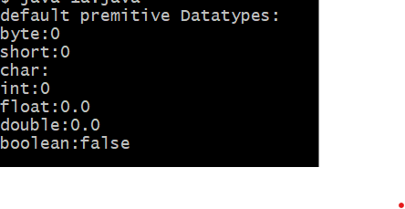

# EXPERIMENT 1
## TITLE : 1a.) Display Primitive Datatypes
```
class Datatypes{
static bytes b;
static short s;
static float f;
static char c;
static int i;
static double d;
static boolean bool;
public static void main(String[] args){
System.out.println("default primitive Datatypes:");
System.out.println("bytes:"+b);
System.out.println("short:"+s);
System.out.println("float:"+f);
System.out.println("char:"+c);
System.out.println("int:"+i);
System.out.println("double:"+d);
System.out.println("boolean:"+bool);
}
}
```
# OUTPUT 

